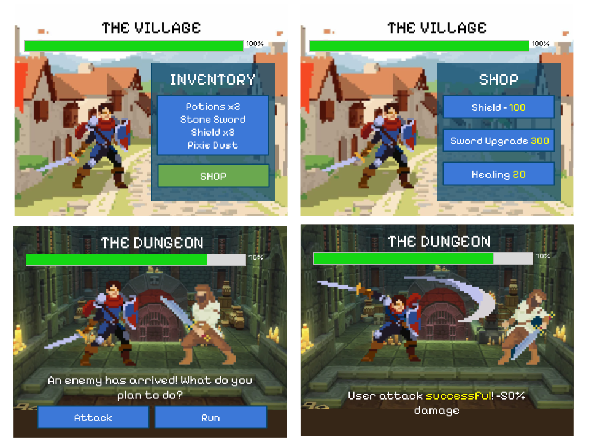

# RPG Battle Quest

## Description
RPG Battle Quest is a simple RPG style fighting game that consist of two main screens: one of a village and one a battle screen. When in the town, players can purchase food and potions, upgrade items, and prepare themselves for battle. During battles, players can face random NPC and can choose to attack with items from their inventory, or run with a 90% success rate. Player must complete battles to progress. The game uses a database to store inventory, store shops items, and the results from battles.

## Mockups

